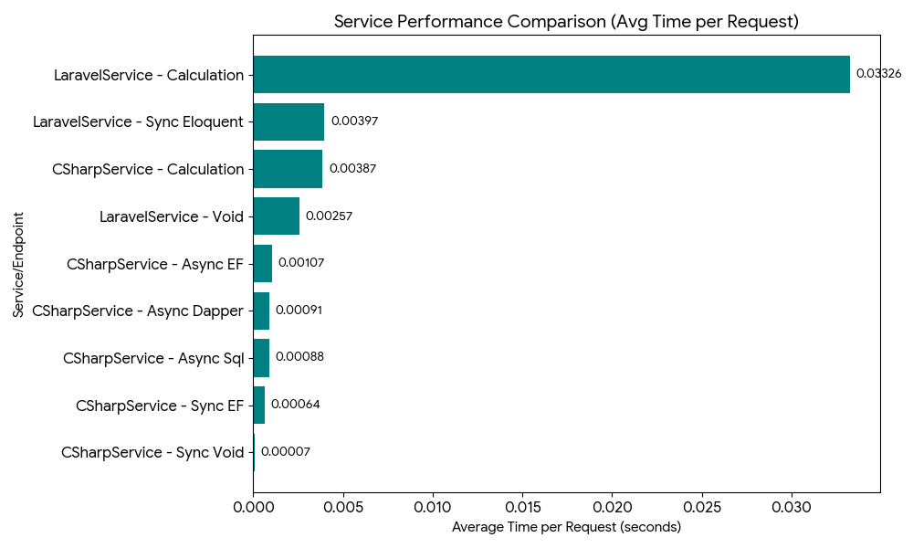

## Performance Review Summary

The results show a stark contrast between the C# services (generally high-speed) and the Laravel services (generally lower speed), as well as the significant performance cost associated with complex operations (database access and heavy calculation).



## Key Observations and Analysis (Concise)

### 1. Framework Overhead
* **Laravel's base overhead** for a simple 'Void' call (0.00257s) is **~35 times higher** than the C\# equivalent (0.00007s). This indicates a high fundamental cost associated with the PHP/Laravel environment setup.

### 2. Database Performance (I/O)
* All **C\# database endpoints** are tightly clustered (between 0.00064s and 0.00107s), with **Sync EF being the fastest**.
* The **Laravel database call** (`Sync Eloquent` at $0.00397$s) is significantly slower, taking **up to 6 times longer** than the fastest C\# database call.

### 3. Calculation Performance (CPU)
* The **Laravel - Calculation** endpoint is the **slowest overall** ( 0.03326s), demonstrating poor performance for CPU-intensive tasks.
* The C\# equivalent (`CSharpService - Calculation`) is much faster at $0.00387$s, making it **~8.6 times quicker** than the Laravel version for the same computation.
## Benchmark Results

| Service | URL | Total Time(s) | Success Count | Avg per Request(s) |
| :--- | :--- | :--- | :--- | :--- |
| CSharpService<br>Async Entity Framework | http://localhost:5230/api/products/async | 1.0691706 | 1000/1000 | 0.0010691 |
| CSharpService<br>Sync Entity Framework | http://localhost:5230/api/products | 0.6449229 | 1000/1000 | 0.0006449 |
| CSharpService<br>Async Sql | http://localhost:5230/api/products/sql | 0.8792655 | 1000/1000 | 0.0008792 |
| CSharpService<br>Async Dapper Framework | http://localhost:5230/api/products/dapper | 0.9100928 | 1000/1000 | 0.0009100 |
| CSharpService<br>Sync Void | http://localhost:5230/api/test/void | 0.0719208 | 1000/1000 | 0.0000719 |
| CSharpService<br>Calculation | http://localhost:5230/api/test/calculation | 3.8727525 | 1000/1000 | 0.0038727 |
| LaravelService<br>Sync Eloquent | http://127.0.0.1:8000/api/products | 3.9727091 | 1000/1000 | 0.0039727 |
| LaravelService<br>Void | http://127.0.0.1:8000/api/test/void | 2.5710250 | 1000/1000 | 0.0025710 |
| LaravelService<br>Calculation | http://127.0.0.1:8000/api/test/calculation | 00:00:33.2596666 | 1000/1000 | 0.0332596 |

Then I removed Entity Framework and re-ran the tests using only the Dapper micro-ORM.

| Run | Service                      | URL                                                                                    | Total Time       | Success (ok/total) | Avg per Request  |
| --- | ---------------------------- | -------------------------------------------------------------------------------------- | ---------------- | ------------------ | ---------------- |
| 1   | CSharpService<br>Async Dapper | [http://localhost:5230/api/products/dapper](http://localhost:5230/api/products/dapper) | 0.5445311 | 1000/1000          | 0.0005445 |
| 2   | CSharpService<br>Async Dapper | [http://localhost:5230/api/products/dapper](http://localhost:5230/api/products/dapper) | 0.3056279 | 1000/1000          | 0.0003056 |
| 3   | CSharpService<br>Async Dapper | [http://localhost:5230/api/products/dapper](http://localhost:5230/api/products/dapper) | 0.2998230 | 1000/1000          | 0.0002998 | 

## How  

This README explains three separate repositories created for performance testing:

1. **C# Service Repository**  
   - Implements a REST API using **.NET Core** and **Entity Framework Core**.
   - Connects to a MySQL database.
   - Endpoint: `GET /api/products`
   - Repository: `CSharpService`

2. **Laravel Service Repository**  
   - Implements a REST API using **Laravel 12** and **Eloquent ORM**.
   - Connects to the same MySQL database.
   - Endpoint: `GET /api/products`
   - Repository: `LaravelService`

3. **Test Service Repository**  
   - Contains scripts and tools for **benchmarking** both services.
   - Repository: `TestService`

## Purpose

The goal is to benchmark the **performance** and **response time** of the two services under the same load and data set. Both services use a single table in the database, and the same query logic is implemented in both technologies.

## Usage

1. Clone all respective repositories.  
- https://github.com/serdargulum/LarevelService
- https://github.com/serdargulum/CSharpService

2. Configure the database connection in each repository as described in their README.md files and run services.
3. Use LaravelService migrations to create and populate the database.
```bash
php artisan migrate   

php artisan db:seed
```
4. Use the TestService repository to send requests to the respective APIs and measure response time.
 ```bash
 dotnet run
 ```